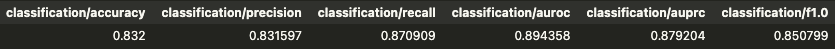

# Disaster Tweets Classifier

Fine-tune an ada (OpenAI) to identify tweets indicating disaster:
- disaster: "Forest fire near La Ronge Sask. Canada"
- not-disaster: "on the outside you're ablaze and alive but you're dead inside"

</img>

## Motivation
- Problems
  - 1. Needing to manually examine and verify tons of tweets (Labor-Intensive, Time-Consuming)
  - 2. Complex steps to build ML model (e.g. Cleaning, Tokenizing, Vectorizing, Feature Engineering...)
- Solution
  - 1. Building text classifier
  - 2. Use of OpenAI API

## Contents

- Exploratory Data Analysis (EDA)
- Data Manipulation
- Fine-tuning 
- Results and expected model performance

## Conclusions

- Fairly good classifier with minimum effort thanks to the power of OpenAI

## Tools

 - [ydata-profiling](https://github.com/ydataai/ydata-profiling) for EDA

 
 - [OpenAI API](https://platform.openai.com/docs/guides/fine-tuning) for fine-tuning and prediction

## Roadmap

- Use of the latest model (GPT-4)

## Data Sources

 - Tweets: [Natural Language Processing with Disaster Tweets (Kaggle)](https://www.kaggle.com/competitions/nlp-getting-started)
